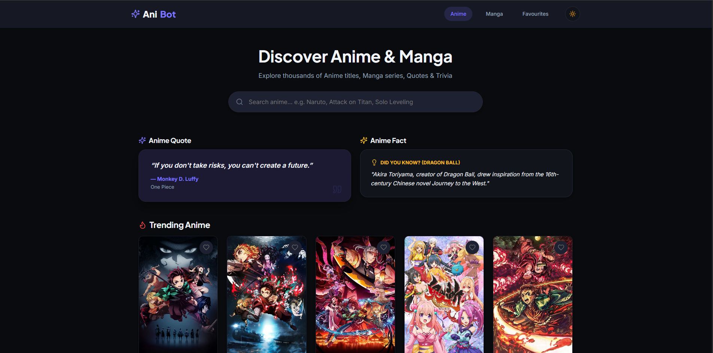
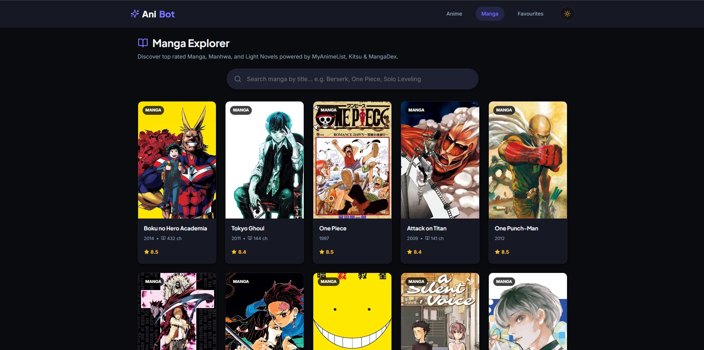

# AniBot — Unified Anime & Manga Discovery Platform

 AniBot is a clean, modern discovery platform for Anime, Manga, Quotes, and Trivia built with React, TypeScript, and a unified multi-provider REST API data layer.

👉 **[Visit Now (Live Demo)](https://singhadityahere.github.io/AniBot/)**

---

## Features

- Anime Discovery Engine powered by MyAnimeList (Jikan v4 API) and Kitsu REST API
- Manga Explorer for Manga, Manhwa, and Light Novels via MangaDex and Kitsu Manga APIs
- Real-Time Search Suggestions with live auto-complete dropdown
- Daily Anime Quotes & Trivia powered by AnimeChan and Anime Facts APIs
- Light and Dark mode theme system with automatic persistence
- Favourites and Search History stored locally in the browser
- Zero-config GitHub Pages support with direct browser API fetching

## Tech Stack

- Frontend: React 18, TypeScript, Vite, React Router v6, TanStack Query, Lucide Icons
- Backend: Node.js, Express, Prisma ORM, SQLite
- APIs: Jikan v4, Kitsu API, MangaDex API, AnimeChan API, Anime Facts API

## Local Development

```bash
# Clone repository
git clone https://github.com/SinghAdityaHere/AniBot.git
cd AniBot

# Install dependencies
npm install

# Start backend and frontend concurrently
npm run dev
```

- Frontend SPA: http://localhost:3000
- Backend REST API: http://localhost:3001

---

## Project Preview




